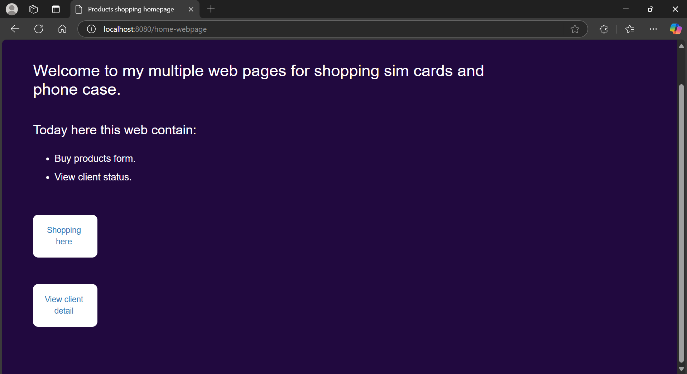
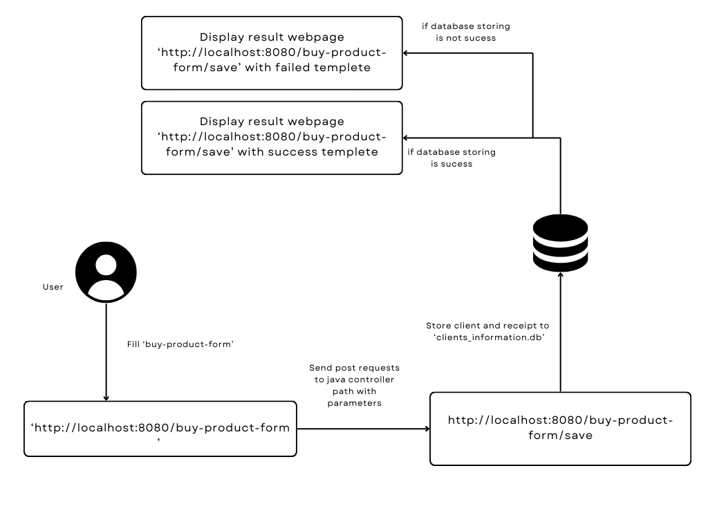
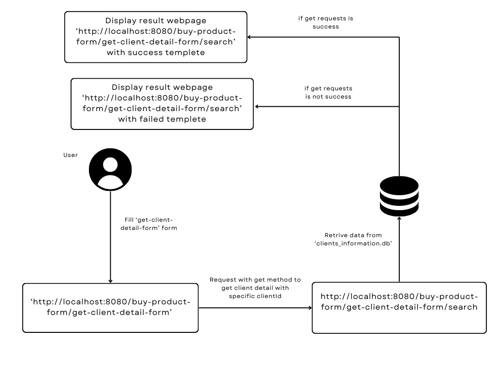

# product-shop-website
**product-shop-website** projects is developed by Java using **Spring Boot** and **Thymeleaf** frameworks to provide an interactive website that allow users to fill the form to buy products and check for client detail which is stored in database.

## Overview
The project utilize **Spring Boot** framework along with **Thymeleaf** to provide *Springboot website* features multiple web page for storing data in frontend side by fill `buy-product-form` and looking for client detail by specific `Client.clientId`



## Forms
This project utilize 2 forms which rendered as 2 paths.

1. `buy-product-form` used to receive a buy product from users. Use `localhost:8080/buy-product-form` to access this form.
2. `get-client-id-detail-form` used to search client details from specified `client_id`. Use `localhost:8080/get-client-id-detail-form` to access this form.

## Diagram
### Buy product form


### Get client detail form


## Usage 
Before executing projects, a few initial setup is necessary.

### Custom Setup 
1. Users can custom setup `products_data.json` for products data. 

    Bear in mind, data structure must be:
    ```JSON
    {
        "SIM_STANDARD": {
            "name": "SIM_STANDARD",
            "price": 450
        },
        "SIM_PREMIUM": {
            "name": "SIM_PREMIUM",
            "price": 700
        },
        "phone_case": {
            "name": "phone_case",
            "price": 300
        }
    }
    ```

2. User can set `status` in `ClientForm.java`.
    ```Java
    public void setStatusRefernceFromPayment() {
        this.status = this.totalPayment >= 2000 ? "Premium": 
                      this.totalPayment >= 1000 ? "VIP":
                      "Standard";
    }
    ```

### Executing Project
If changed has made. `build` command should be executed first. 
```Bash
.\gradlew build
```

Execute project with `main-website` parent directory.
```Bash
.\gradlew bootRun
```